# Huntress CTF 2026: Day 1

**Category:** CTF
**Event:** [Huntress CTF 2026](https://ctf.huntress.com) (runs through October)
**Date:** 2026-10-07
**Tags:** huntress-ctf, ai-assisted, automation, base64, hashing, powershell, mitre-attack, android, elf, reverse-engineering

> **Flags are redacted.** Flags this year are unique to each team, and the rules ask players not to share them, so every flag and completion code in the text and screenshots is blacked out. Answers that change with every attempt (decoded slugs, file hashes, indicators) are left in, since they're specific to the artifact I was given.

## Overview

This was my first CTF. Huntress built this year's event around AI: you work in a browser-based environment (Homebase) with an AI assistant, and challenges are handed out and graded by an AI **Game Master**. Each challenge has three modes:

- **Single Solve:** one artifact, no time limit.
- **Time Trial:** a fresh, randomized artifact that has to be solved within a short deadline (about 30 seconds).
- **Mastery:** several fresh artifacts at once, under an even tighter deadline.

Because every attempt gets new inputs, you can't solve it once and reuse the answer. Huntress's challenge to players is basically: can you build tooling general enough to put a month-long CTF on autopilot? So for each challenge I had the AI write a reusable script, checked it on the Single Solve, then reused it for the Time Trial and Mastery.

The scripts are in [`scripts/`](scripts/).

## Day 1 Results

| Challenge | Topic | Single | Time Trial | Mastery |
|---|---|---|---|---|
| Read the Rules | Warm-up | ✅ | n/a | n/a |
| A Little Based | Base64 | ✅ | ✅ | ✅ |
| You Must Be This Hash to Ride | File hashing | ✅ | ✅ | ✅ |
| Power Play | PowerShell triage | ✅ | ✅ | ✅ |
| Exported Trust | Android | ❌ blocked | n/a | n/a |
| ELF Aware | ELF binaries | ✅ | ✅ | ✅ |

Welcome Robots and Sanity Check were also warm-ups. They just confirm you can talk to the Game Master and understand the rules.

## Read the Rules

The rules page says there's no flag on it, but the challenge says a careful reader will find one. Hidden in plain sight usually means in the page source. I opened the browser's developer tools (Ctrl+Shift+I), searched the Inspector for `flag`, and scrolled through the matches until I found it in an HTML comment near the bottom of the page.

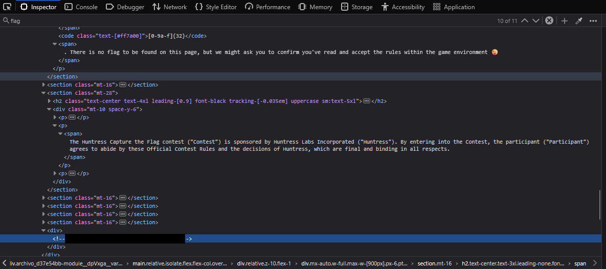

## A Little Based

The artifact is a Base64-encoded blob. The answer is a slug (three lowercase words and a two-digit number, like `word-word-word-00`) found on the last non-empty line after decoding.

**Single Solve:** `base64 -d` on the blob printed the instruction and the slug to submit.

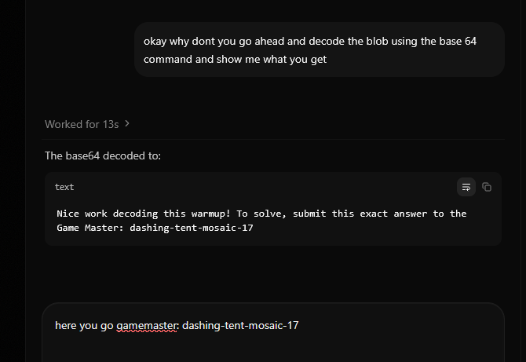

**Time Trial:** My first try failed the 30-second deadline because I was copying the answer over and submitting it myself. On the second try I had the agent run the whole loop on its own: start the attempt, download the artifact, decode it, and submit.

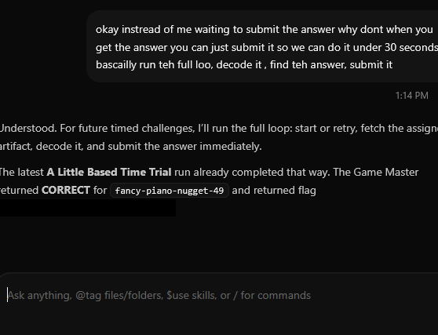

**Mastery:** Three new blobs within 30 seconds. These had a `01` prefix stuck to the front of the data, so a plain `base64 -d` wouldn't work. The agent removed the prefix, decoded each blob, and submitted all three slugs before the deadline.

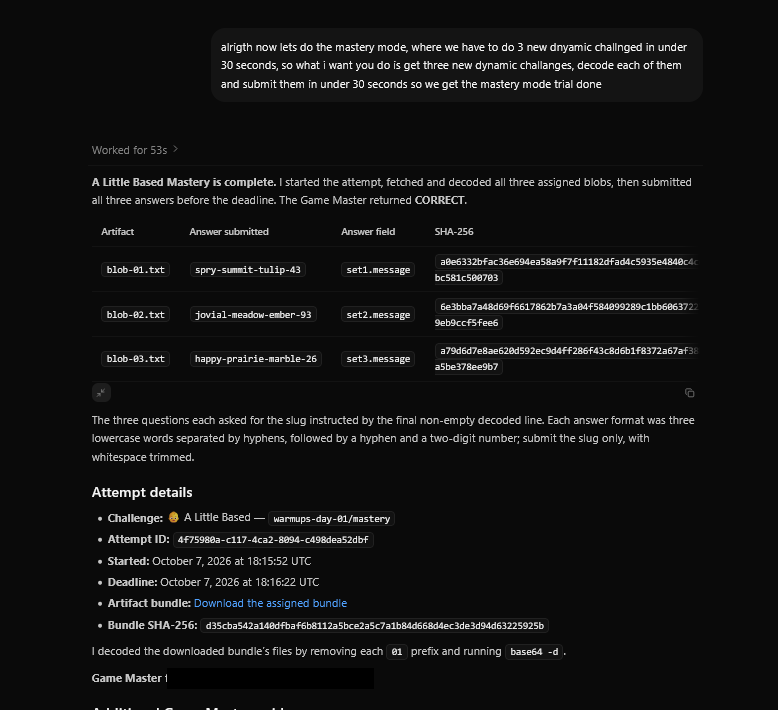

## You Must Be This Hash to Ride

The files come with labels you can't trust, so you have to identify each one from its actual contents. Five answers for the file inside the ZIP: exact filename, size in bytes, MD5, SHA-1, and SHA-256.

You could do this with a metadata viewer, but a script can be reused. I asked for a Python script ([`metadata_hashes.py`](scripts/metadata_hashes.py)) that uses the `zipfile` module to read the file inside the ZIP directly, without extracting it, and hash its contents.

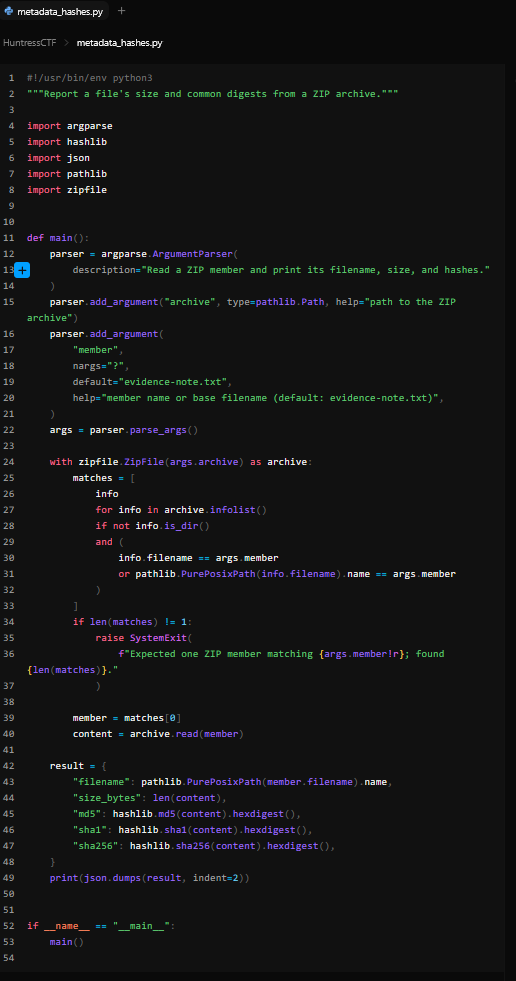

**Single Solve:** `evidence-note.txt`, 240 bytes, plus its three hashes. All five were accepted.

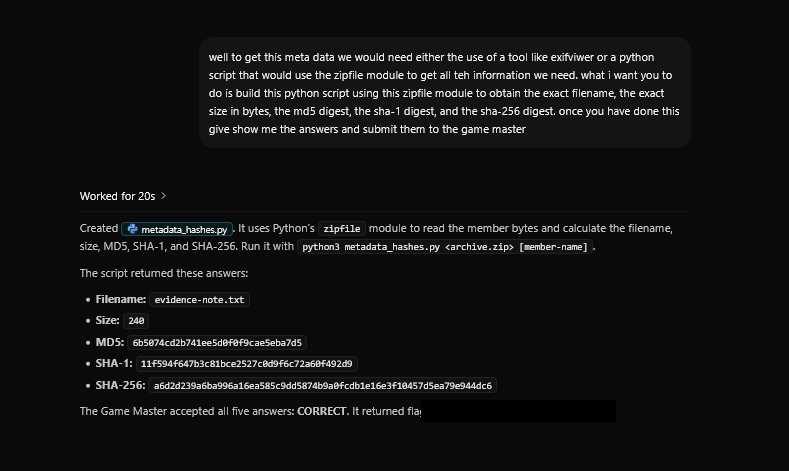

**Time Trial:** The new artifact contained a different file (`roster.csv`, 129 bytes). The script takes the filename as an argument, so it handled the change without any edits.

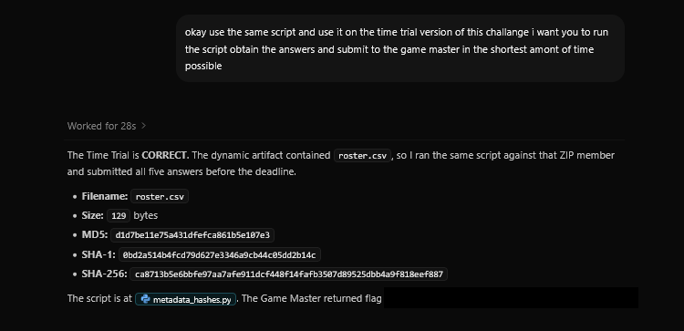

**Mastery:** The same script, run on each new artifact, passed Mastery too.

## Power Play

Three PowerShell samples, never to be executed. For each one: what kind of attack it is, its primary MITRE ATT&CK technique, and its indicators. That's 15 answers.

Some answers are asked for every sample (scenario, technique), and some only for one (a wallet address, a user agent, a ransom note filename). Instead of writing three scripts, I asked for one analyzer that covers all of them.

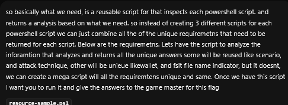

The analyzer ([`analyze_powershell_samples.py`](scripts/analyze_powershell_samples.py)) reads the scripts as text without running them, decodes the Base64 JSON embedded in each one, classifies it, and pulls out the indicators.

The classification is the part I found most useful. Besides the decoded data, it looks at which .NET classes each script references, because those show what the script is built to do:

- **`System.Diagnostics.Process`** plus a `wallet_` value means it starts a process tied to a crypto wallet: cryptomining.
- **`System.Security.Cryptography.Aes`** plus a new file extension and a `RECOVERY-` note means it encrypts files and leaves a ransom note: ransomware.
- **`System.IO.Compression.ZipFile`** plus browser files like `Login Data` and `Cookies` means it zips up browser credential stores: data collection. The sample ZIP is AES-encrypted with the password `infected`, which is the usual convention for sharing malware samples. That means the script needs `pyzipper`, since Python's built-in `zipfile` can't open AES-encrypted ZIPs.

| Sample | Scenario | ATT&CK technique | Key indicators |
|---|---|---|---|
| resource | Cryptomining | **T1496** Resource Hijacking | Payload URL, wallet address, mutex |
| collection | Data collection | **T1555.003** Credentials from Web Browsers | Payload URL, dropped filename, user agent |
| impact | Ransomware | **T1486** Data Encrypted for Impact | Encrypted file extension, ransom note filename, URL |

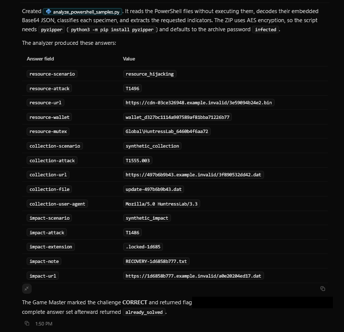

The same analyzer handled the Time Trial. For **Mastery** (two new sets, 30 answers, 20 seconds), it submitted everything in about two seconds. I also had the agent save the timed-mode steps as a reusable skill (`huntress-powerplay-timed`). Once the Single Solve script works, the skill can start and finish the Time Trial and Mastery without me writing new prompts.

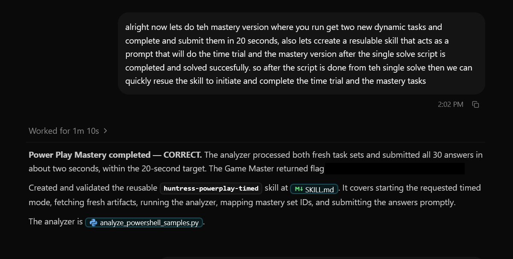

## Exported Trust (unsolved)

An Android challenge: find an **exported deep-link Activity** in the APK that attaches an embedded client credential, launch it with the given case reference, and submit the evidence code the backend returns.

Some background I had to learn for this one:

- An Android **Activity** is a screen in an app. If it's **exported**, other apps (and `adb`) can launch it directly.
- A **deep link** is an intent filter with `VIEW`, `BROWSABLE`, and `DEFAULT` that lets a URI open that Activity.
- The vulnerability is in the name: an exported entry point that automatically attaches the app's own credential lets *anyone* who can send it a link make authenticated requests.

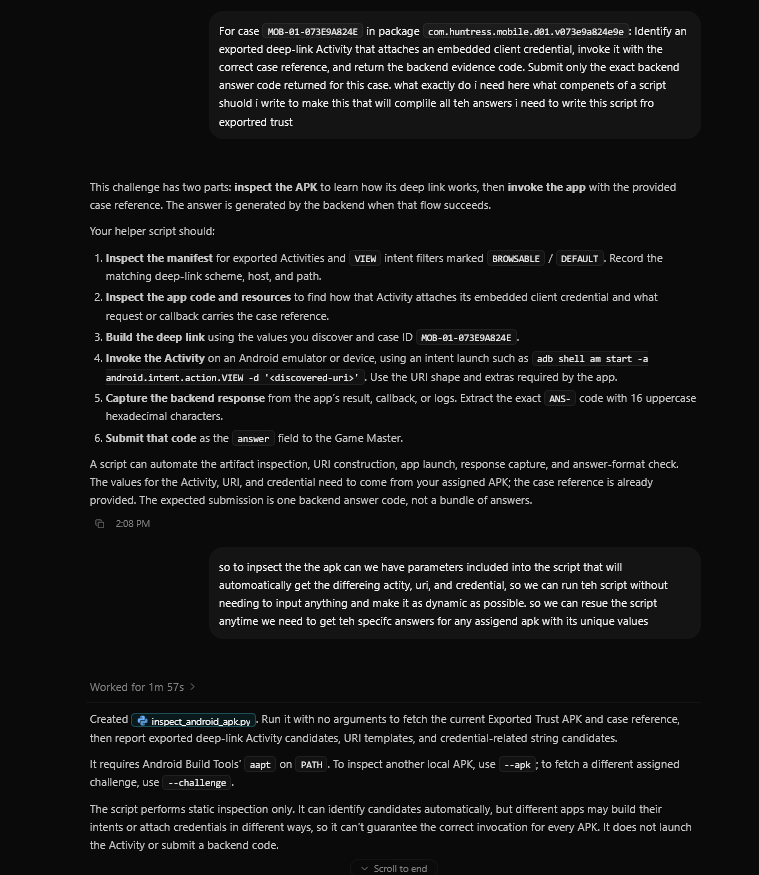

The agent wrote `inspect_android_apk.py` (not included here since I didn't finish the challenge). It fetches the assigned APK and uses `aapt` to list exported Activities with deep-link intent filters, their URI patterns, and strings that look like credentials. That's the static half. The second half requires actually launching the Activity (`adb shell am start -a android.intent.action.VIEW -d '<uri>'`), which needs an Android emulator or device. My environment didn't have one. I turned on **Agent device access**, but no device host was set up. Adding one means connecting a machine that has an emulator runtime and hardware virtualization. That was more than I wanted to take on for one challenge, so I moved on.

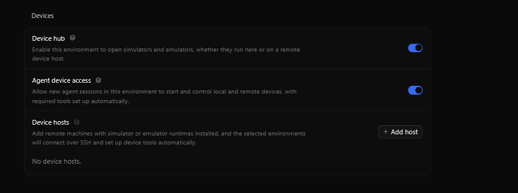

## ELF Aware

An introduction to reverse engineering: read an ELF binary's header, section table, and symbol table, and answer nine questions about it.

`readelf -h -S` gives most of it. Note the custom `.huntress` section at index 14.

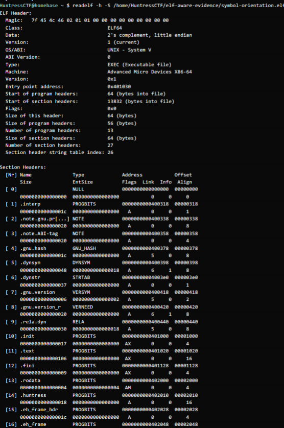

| Question | Where to find it | Single Solve answer |
|---|---|---|
| ELF class | ELF header | `ELF64` |
| Byte order | ELF header | `little` |
| Machine | ELF header | `x86-64` |
| Object type | ELF header | `ET_EXEC` |
| Entry point | ELF header | `0x401030` |
| `.huntress` marker | Custom section contents | `BR01-SYMBOL-ORIENTATION` |
| `.symtab` retained? | Section table | `true` |
| Designated analysis symbol | Symbol table | `recover_code` |
| Constant returned | Disassembly of `recover_code` | `1337` |

The constant is visible in the disassembly as a value loaded straight into the return register. Useful commands:

```bash
file symbol-orientation.elf
readelf -h -S -W symbol-orientation.elf        # header + sections
readelf -Ws symbol-orientation.elf             # symbol table
objdump -d -M intel --disassemble=recover_code symbol-orientation.elf
objcopy --dump-section .huntress=marker.bin symbol-orientation.elf
```

I had the agent combine these into [`run_elf_challenge.py`](scripts/run_elf_challenge.py). It downloads the assigned artifact, finds ELF files by their magic bytes (`\x7fELF`) even inside nested ZIPs, runs the commands above on each one, and submits answers matched to the question IDs the Game Master gives for that attempt. A few details from the code:

- The designated symbol is the first global function that isn't `main` or `_start`.
- The returned constant is pulled from the disassembly by finding the `mov eax, 0x...` instruction and converting it to decimal (`0x539` → `1337`).
- Any field it can't find (no `.huntress` section, no `recover_code`) defaults to `none`.
- In timed modes, if the previous attempt's deadline has passed, it uses the retry operation instead of starting a new attempt.

It took about 10 minutes to build, and then all three modes passed.

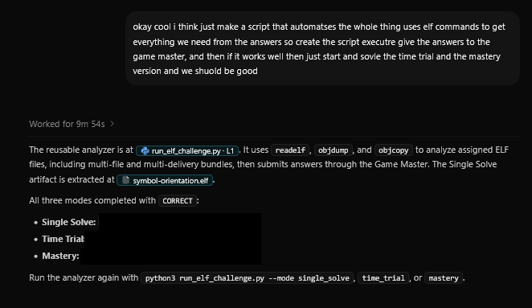

The timed modes mixed in other kinds of binaries, which is where a script built only for the Single Solve sample would have failed:

- **Stripped:** no symbol table, so there's no designated symbol or returned constant to report.
- **Section-beacon:** no `recover_code` symbol. The accepted answer for that field was `none`.
- **Immediate-recovery:** the function returned `7331` instead of `1337`.

Some timed attempts ran out of time and were restarted with the retry option before the final submissions went through.

## Lessons Learned

- **Look in the page source.** "Hidden in plain sight" on a web page usually means the source, like an HTML comment.
- **Hash the contents, not the label.** Filenames and labels can be wrong. The file's contents can't.
- **Read malware, don't run it.** All of Power Play was answered by reading the scripts as text and decoding what was embedded in them.
- **Timed modes test whether the tool handles variation.** Base64 with a prefix, a different file in the ZIP, stripped binaries: the Single Solve works on one example, and the timed modes find what the script didn't account for. Answer formats change too, such as `none` when a symbol is missing.
- **Know when you're blocked by missing setup, not missing knowledge.** Exported Trust needed an emulator I didn't have. Recognizing that and moving on was the right call for Day 1.
- **Make sure you're still learning.** Prompting got the points, but on Exported Trust I realized I wasn't learning how to inspect a manifest or build a deep link myself. Writing this up and reading what each script does is how I'm trying to fix that.
