# Autopsy

**Category:** TryHackMe
**Difficulty:** Easy
**Date:** 2026-10-01
**Tags:** autopsy, disk-forensics, recycle-bin, keyword-search, timeline, dfir

Room: https://tryhackme.com/room/btautopsye0

## Overview

An introduction to Autopsy, the open-source disk forensics platform. The case is a Windows 7 disk image (`sample-case.dd`) belonging to a user called `informant`, and the room walks through Autopsy's main views: data sources, ingest module results, summaries, reports, keyword search, and the timeline. It ends with a short investigation scenario.

Tasks 1–4 cover setting up a case and adding a data source, and they're straightforward, so this writeup starts at Task 5. The interesting part for me was that Autopsy often shows the same thing in several places with different numbers, and only one of them answers the question.

## Where Things Live in Autopsy

| Tree section | What it shows | Used for |
|---|---|---|
| **Data Sources** | The raw file system of the image, volume by volume | Browsing to a known path (like the Sticky Notes file) |
| **Views** | Files grouped by type, size, or deleted status | Every deleted file on the image |
| **Results > Extracted Content** | Artifacts parsed by the ingest modules: OS info, installed programs, recycle bin, web searches, user accounts, and more | Most of the answers in this room |
| **Results > Interesting Items** | Files flagged by the Interesting Files Identifier module | The flagged cloud storage binary |
| **Summary tab** (on a data source) | File type breakdown, analysis hit counts | Percentage of documents on the drive |
| **Keyword Search** (top right) | Full-text search of indexed file contents | Password hint, network drive files |
| **Timeline** | Events plotted by date, filterable by type | Event counts on specific days |
| **Generate Report** | HTML/other report of the case | Ingest job details |

## Task 5: Data Sources and Ingest Results

### Q: What is the number of detected removed files?

The hint says to look at the Recycle Bin, but there are three different Recycle Bins in Autopsy, each with its own number:

1. **Data Sources > vol3 > `$Recycle.Bin` > `S-1-5-21-...-1000`: 29.** This is the raw folder for one user's recycle bin. Windows stores each recycled item as two files: an `$I` file with metadata (original path and deletion time) and an `$R` file with the actual contents. The folder count includes both halves of every item, the `[current folder]` and `[parent folder]` entries, and leftovers from items that were already purged. That's more than the number of deleted items. Not the answer.

   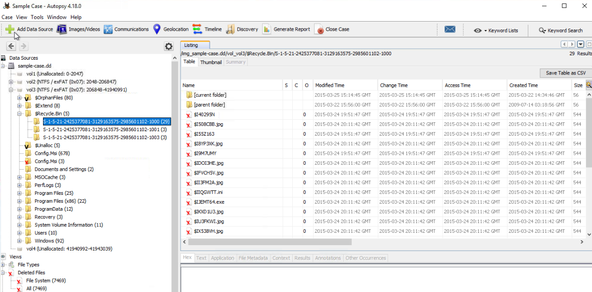

2. **Views > Deleted Files: 7469.** This is every file on the whole image that the file system marks as deleted, whether or not it went through the Recycle Bin. Not the answer either.

3. **Results > Extracted Content > Recycle Bin: 10.** Autopsy's Recycle Bin module parses the `$I`/`$R` pairs into one entry per deleted item, with its original path, deletion time, and the user who deleted it.

**Answer: `10`**

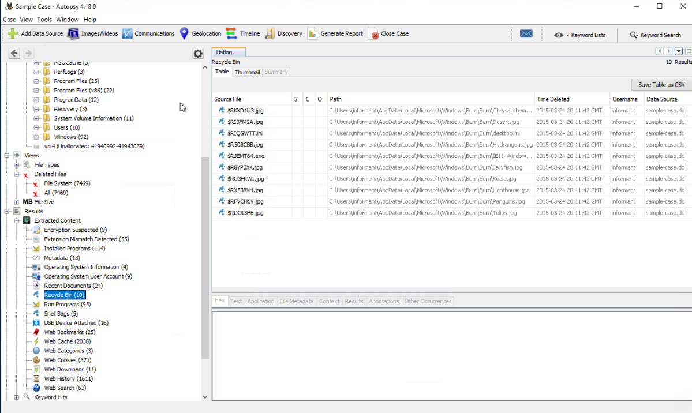

All 10 items were deleted by `informant` on 2015-03-24 from the same folder: `AppData\Local\Microsoft\Windows\Burn\Burn\`. That's the Windows staging area for burning files to a CD. This comes up again in the scenario.

### Q: What is the filename found under the Interesting Files section?

I started at the data source's **Summary > Analysis** tab, which lists an Interesting Item Hit called "Cloud Storage" with a count of 2. That's the name of the rule that matched, not a filename, and clicking it doesn't take you to the files.

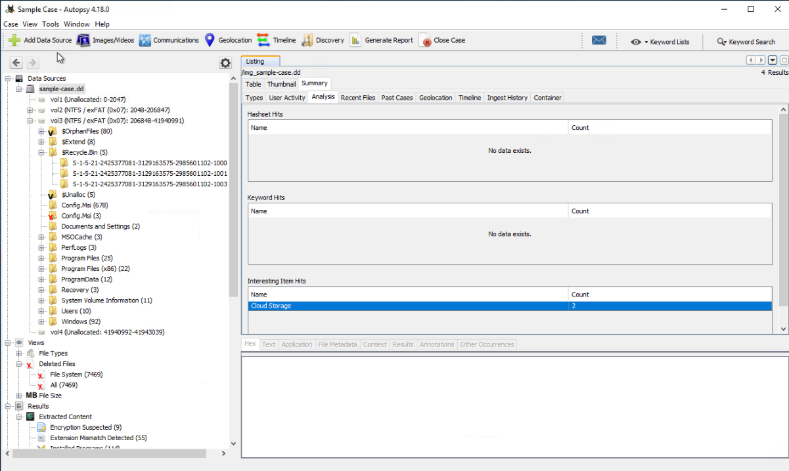

The files themselves are under **Results > Interesting Items > Cloud Storage > Interesting Files**: two copies of the same binary.

**Answer: `googledrivesync.exe`**

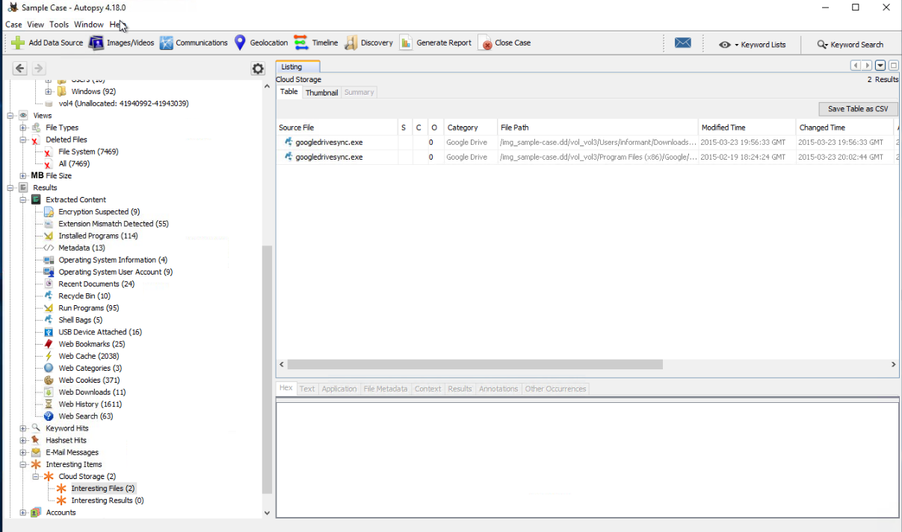

## Task 6: Summaries and Reports

### Q: What is the full name of the operating system?

**Results > Extracted Content > Operating System Information**

**Answer: `Windows 7 Ultimate Service Pack 1`**

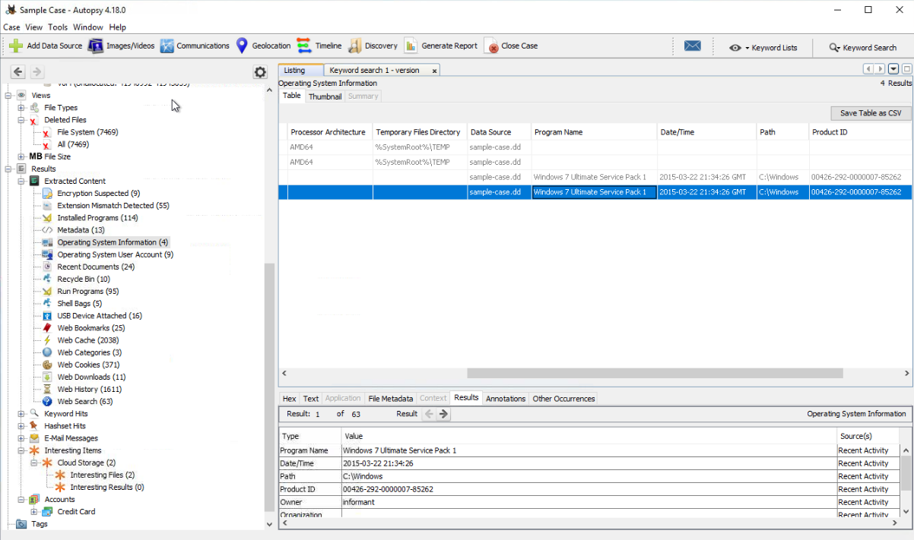

### Q: What percentage of the drive are documents?

The data source's **Summary > Types** tab has a pie chart of file types.

**Answer: `40.8%`**

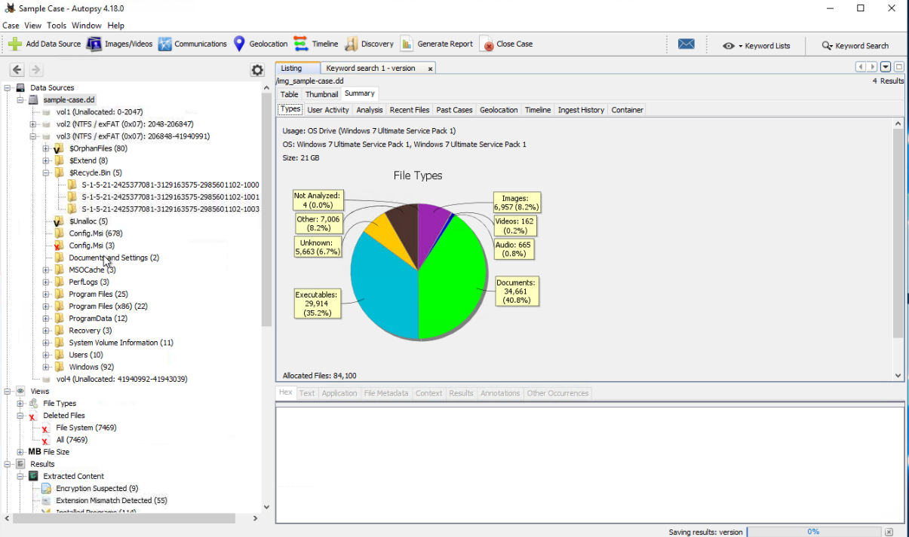

### Q: What job number ran the Interesting Files Identifier module?

I generated an HTML report from **Generate Report** and opened it. The **Case Summary** page lists each ingest job and the modules it ran.

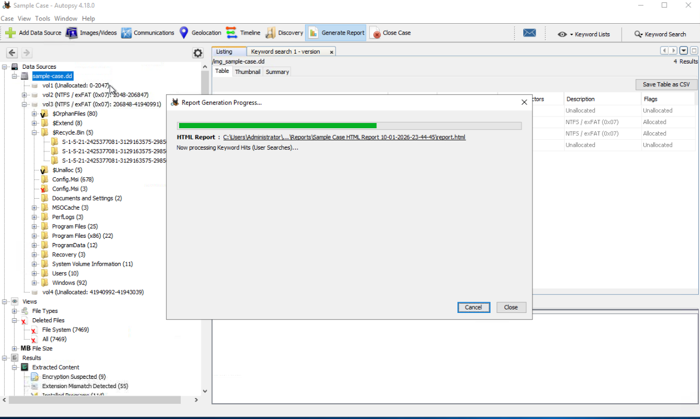

**Answer: `10`**

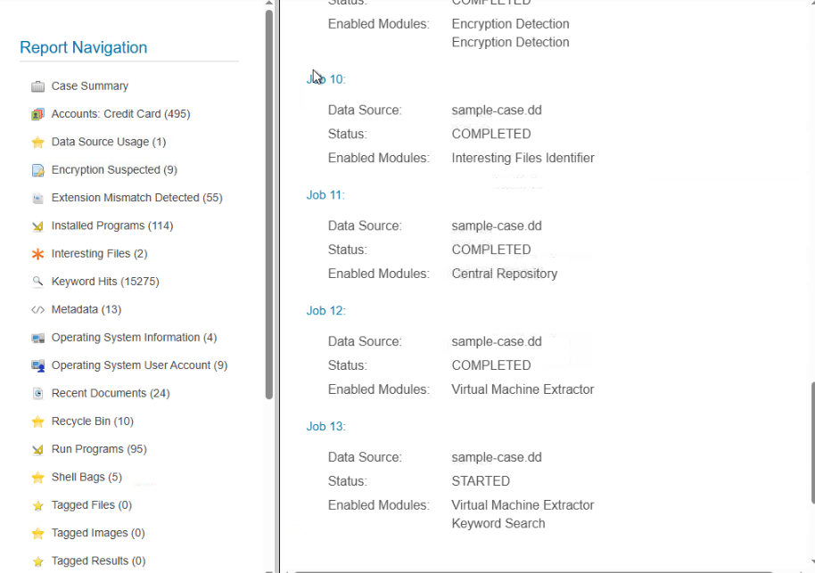

## Task 7: Investigation Scenario

This task asks questions about what `informant` was doing on the machine.

### Q: What is the name of the installed program with version 6.2.0.2962?

**Results > Extracted Content > Installed Programs.** I scrolled until I found the version. Searching for it would have been faster.

**Answer: `Eraser`** (installed 2015-03-25 21:57:31)

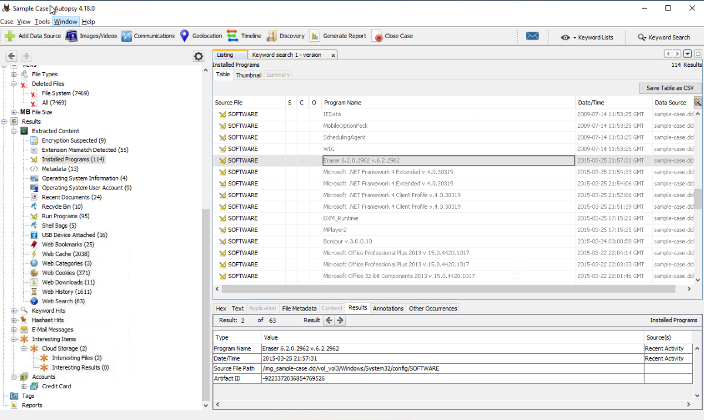

Eraser is a tool for securely wiping files so they can't be recovered.

### Q: A user has a password hint. What is the value?

I ran a keyword search (exact match) for `Password Hint`. One of the hits is the **Operating System User Account** artifact, and its indexed text shows the hint for the account.

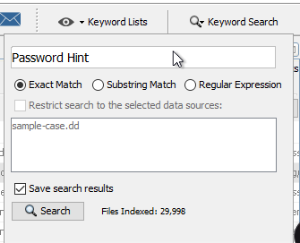

**Answer: `IAMAN`**

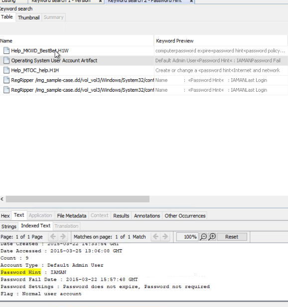

### Q: Numerous secret files were accessed from a network drive. What was the IP address?

Another keyword search, this time for `SECRET`. The hits include `.lnk` shortcuts and jump lists (`automaticDestinations-ms`) pointing at a "Secured Network Drive" with a `Secret Project Data` folder. The shortcut's indexed text shows the full UNC path: `\\10.11.11.128\secured_drive`.

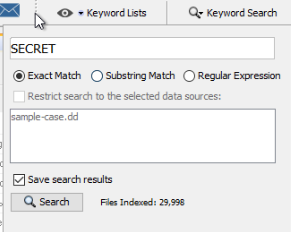

**Answer: `10.11.11.128`**

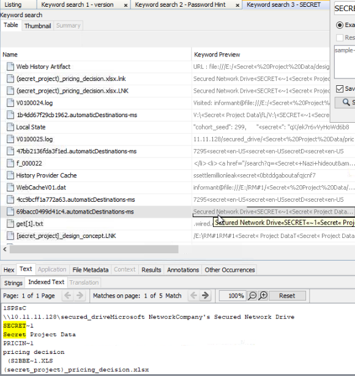

### Q: What web search term has the most entries?

**Results > Extracted Content > Web Search** lists every search Autopsy pulled out of browser history. I went through the list by eye. I wanted to export it with **Save Table as CSV** and count terms with a pivot table, but I couldn't open the CSV in Excel on the VM. Sorting the table by the **Text** column would have grouped the identical terms together.

**Answer: `information leakage cases`**

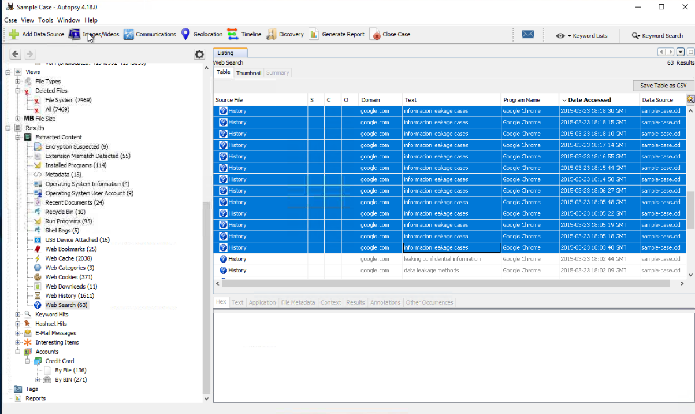

### Q: What web search was conducted on 3/25/2015 at 21:46:44?

Same table, sorted by **Date Accessed**.

**Answer: `anti-forensic tools`**

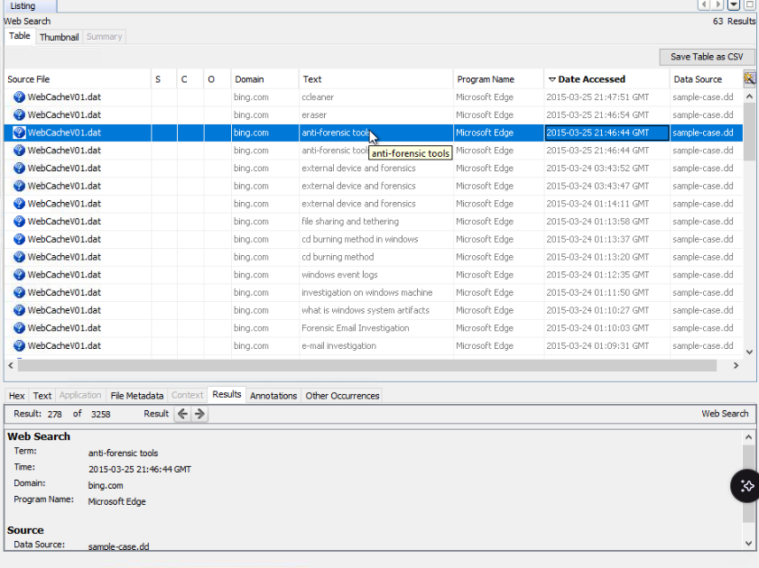

### Q: What is the MD5 hash of the binary listed as an interesting file?

Back to **Interesting Items > Cloud Storage > Interesting Files**. You can scroll the table right to the MD5 column, or select the file and open the **File Metadata** tab at the bottom to copy it. I used the copy in the user's Downloads folder.

**Answer: `fe18b02e890f7a789c576be8abccdc99`**

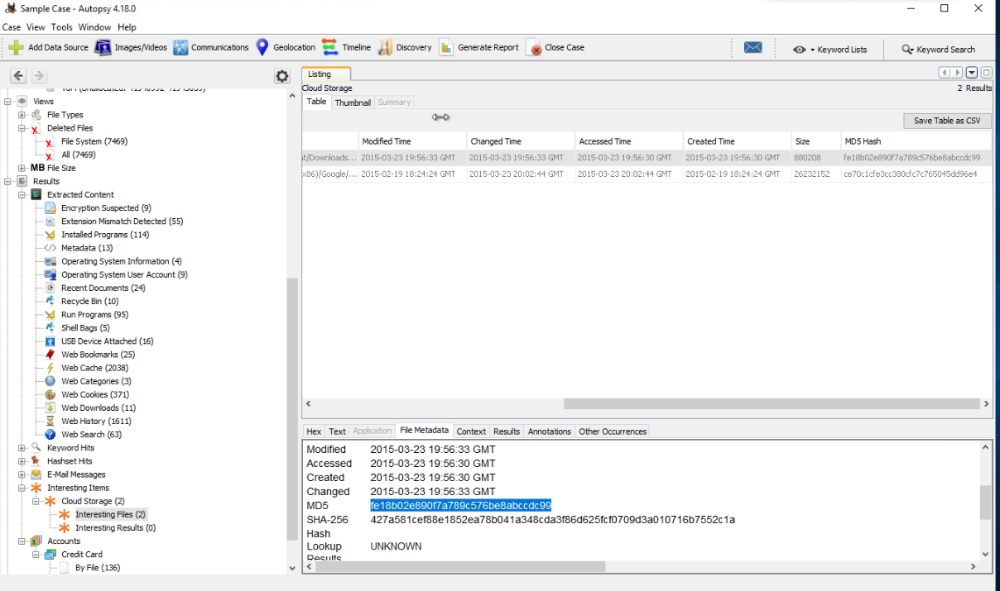

### Q: What self-assuring message did the informant write on a Sticky Note?

This one I had to look up. I tried keyword searches for `Sticky Note` and `.snt` (the Sticky Notes file extension), but they never led me to the note. The answer was in the file system at:

`vol3 > Users > informant > AppData > Roaming > Microsoft > Sticky Notes > StickyNotes.snt`

Its **Text** tab shows the note.

**Answer: `Tomorrow... Everything will be OK...`**

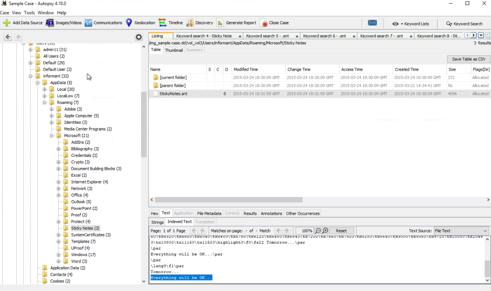

Why keyword search didn't find it: Keyword Search looks for words *inside* files, and the note's contents don't include "Sticky Note" or ".snt". The only `.snt` hit was a file in `System Volume Information` that happens to contain the filename `StickyNotes.snt`. Exact Match also only matches whole words, so `Sticky Note` wouldn't match `StickyNotes` anyway. To find a file by name, it's better to know where the artifact lives (on Windows 7: `%AppData%\Microsoft\Sticky Notes\StickyNotes.snt`) or use Autopsy's file search by name.

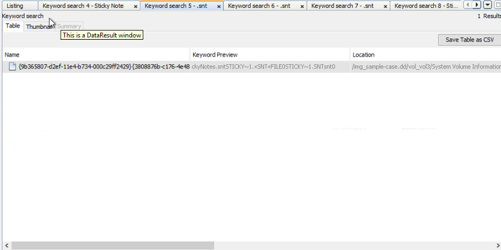

### Putting it together

The answers to this task make a story: the informant searched for information leakage, data leakage methods, CD burning, and anti-forensic tools. They accessed secret project files on a network drive, deleted files from the CD burning staging folder, and installed Eraser. Google Drive's sync client was also downloaded onto the machine.

## Task 8: Timeline

### Q: How many results were there on 2015-01-12?

I clicked through the timeline's Counts view to January 2015 and selected the 12th. The table below the chart showed 46 events. Interestingly, they're all files under `Program Files/Eraser`.

**Answer: `46`**

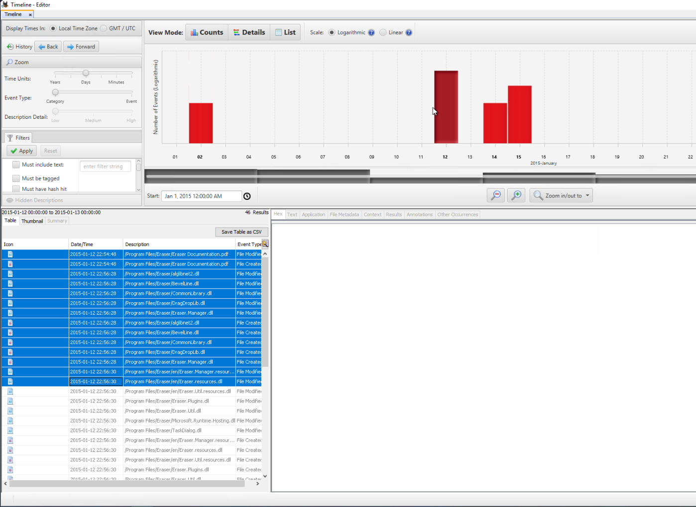

### Q: On what date did the majority of file events occur?

Zoomed out to the full date range, the bars for March 22–25, 2015 are far taller than anything else. The red file system bar was highest on the 25th.

**Answer: `March 25, 2015`**

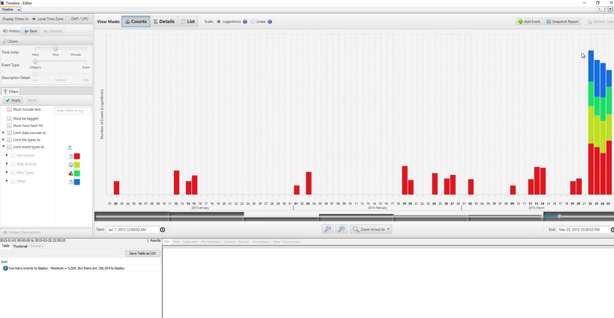

The timeline works, but it's clunky to navigate.

## Lessons Learned

- **The same artifact can show up in several places with different numbers.** The raw `$Recycle.Bin` folder (29), all deleted files (7469), and the parsed Recycle Bin artifact (10) are three different counts. Use **Results > Extracted Content** to see the artifacts parsed into one row per item.
- **Summary views show which rules matched, not the files.** "Cloud Storage: 2" is the name of an Interesting Files rule. The files are under Results > Interesting Items.
- **Keyword search searches inside files, not filenames.** To find a file by name or path, browse to where the artifact is stored or use a file name search. Knowing where Windows keeps artifacts like Sticky Notes saves time.
- **Sort before you count.** For questions like "which term appears most often", sorting the column is faster than counting by eye.
- **Artifacts tell a story when you connect them.** Web searches, recycle bin paths, installed programs, and network shortcuts each answered one question, but together they show the informant planning to leak data and cover their tracks.
