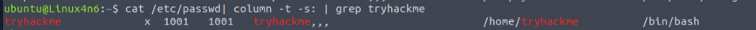
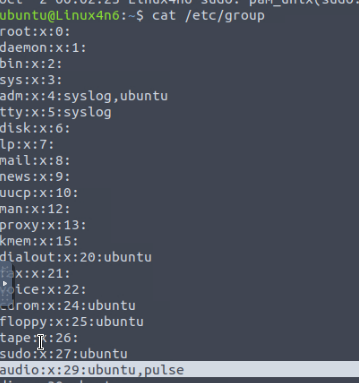
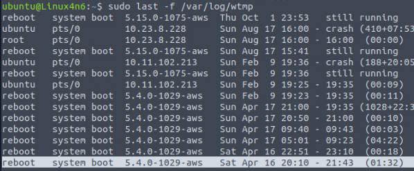
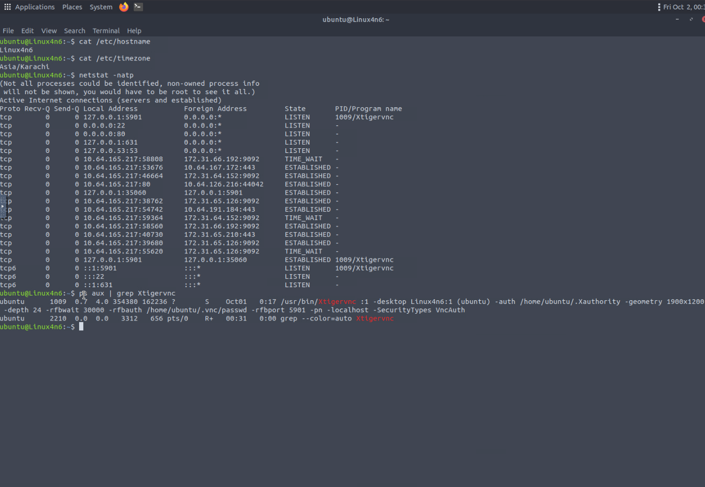
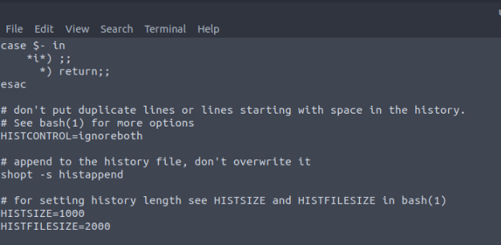
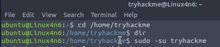
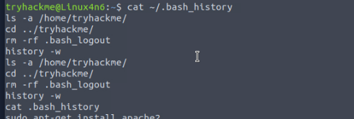
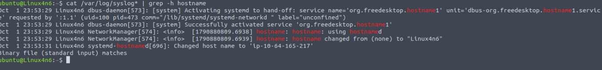

# Linux Forensics

**Category:** TryHackMe
**Difficulty:** Medium
**Date:** 2026-10-01
**Tags:** linux-forensics, dfir, wtmp, bash-history, auth-log, syslog, persistence

Room: https://tryhackme.com/room/linuxforensics

## Overview

The Linux counterpart to [Windows Forensics 1](../windows-forensics-1/README.md) and [2](../windows-forensics-2/README.md). Linux has no registry: system configuration, account data, and activity history all live in plain files, mostly under `/etc`, `/var/log`, and users' home directories. The room is about knowing where those files are and reading them with standard command-line tools. I already had some Linux experience, so this one felt easier than its Medium rating.

## Key Artifacts

| Artifact | Location | What it tells you | How to read it |
|---|---|---|---|
| OS release | `/etc/os-release` | Distribution and version | `cat` |
| User accounts | `/etc/passwd` | Username, UID, GID, description, home directory, default shell | `cat`, `column -t -s:` |
| Groups | `/etc/group` | Groups and their members | `cat` |
| Sudoers | `/etc/sudoers` | Who can run commands as root | `sudo cat` |
| Login history | `/var/log/wtmp` | Historical logins, logouts, and reboots | `last -f` (binary file) |
| Failed logins | `/var/log/btmp` | Failed login attempts | `last -f` (binary file) |
| Auth log | `/var/log/auth.log*` | Authentication events and every `sudo` command, with working directory | `cat` / `grep` |
| Hostname / timezone | `/etc/hostname`, `/etc/timezone` | Machine name and configured timezone | `cat` |
| Network config | `/etc/network/interfaces`, `ip address show` | Interfaces and IP addresses | `cat`, `ip` |
| Connections / processes | `netstat -natp`, `ps aux` | Listening services, active connections, running programs | live commands |
| Cron jobs | `/etc/crontab` | Commands scheduled to run periodically | `cat` |
| Services | `/etc/init.d` | Services that start at boot | `ls` |
| Shell startup | `~/.bashrc`, `/etc/bash.bashrc`, `/etc/profile` | Commands that run whenever a shell starts, plus history settings | `cat` |
| Command history | `~/.bash_history` | Commands a user ran (non-`sudo` ones included) | `cat` |
| Vim history | `~/.viminfo` | Files opened and commands run in Vim | `cat` |
| Syslog | `/var/log/syslog*` | General system activity: cron runs, service events, hostname changes | `cat` / `grep` / `zgrep` |
| Third-party logs | `/var/log/<app>` (e.g. `apache2`, `mysql`) | Web server, database, and file share activity | `ls`, `cat` |

## Task 3: OS and Account Information

### Q: What is the UID of the account named `tryhackme`?

Each `/etc/passwd` line is colon-separated. Piping it through `column` lines the fields up, and `grep` finds the account:

```bash
cat /etc/passwd | column -t -s : | grep tryhackme
```

The third field is the UID.

**Answer: `1001`**



### Q: Which two users are members of the group `audio`?

```bash
cat /etc/group
```

**Answer: `ubuntu,pulse`**



### Q: A session started on Sat Apr 16 20:10. How long did it last?

`wtmp` is a binary file, so it has to be read with `last`:

```bash
sudo last -f /var/log/wtmp
```

The last column of the Apr 16 20:10 entry shows its duration.

**Answer: `01:32`**



## Task 4: System Configuration

Everything in this task was one command per question.

```bash
cat /etc/hostname
cat /etc/timezone
netstat -natp
ps aux | grep Xtigervnc
```



### Q: What is the hostname of the attached VM?

**Answer: `Linux4n6`**

### Q: What is the timezone of the attached VM?

**Answer: `Asia/Karachi`**

### Q: What program is listening on 127.0.0.1:5901?

`netstat -natp` shows `1009/Xtigervnc` on that port. Most of the other rows show `-` instead of a program name because the command wasn't run as root.

**Answer: `Xtigervnc`**

### Q: What is the full path of this program?

`netstat` only gives the name and PID. `ps aux` shows the full command line for PID 1009.

**Answer: `/usr/bin/Xtigervnc`**

## Task 5: Persistence Mechanisms

This task covers the places an attacker (or an admin) can make something run automatically:

- **Cron jobs** run commands on a schedule (`/etc/crontab`).
- **Services** in `/etc/init.d` start in the background at boot.
- **`.bashrc`** and the system-wide shell profiles run every time a bash shell starts.

### Q: What is the size of the history file set for the user `ubuntu`?

```bash
cat ~/.bashrc
```

There are two settings here: `HISTSIZE=1000` is how many commands are kept in memory during a session, and `HISTFILESIZE=2000` is how many are kept in the history file.

**Answer: `2000`**



## Task 6: Evidence of Execution

Commands run with `sudo` are logged in `/var/log/auth.log`. Everything else a user types is in their `~/.bash_history`. Vim keeps its own history in `~/.viminfo`.

### Q: The user `tryhackme` used `apt-get` to install a package. What was the command?

The question is about another user's history, and I couldn't get the path to `/home/tryhackme/.bash_history` working from the `ubuntu` account. So I switched to that user instead and read their history directly:

```bash
sudo -su tryhackme
cat ~/.bash_history
```



**Answer: `sudo apt-get install apache2`**



> In hindsight, staying as `ubuntu` and running `sudo cat /home/tryhackme/.bash_history` would also work. The file belongs to `tryhackme`, so the `ubuntu` account needs root to read it.

### Q: What was the current working directory when the command to install `net-tools` was issued?

Because it was run with `sudo`, it's in the auth log, which records the `PWD` of every sudo command:

```bash
cat /var/log/auth.log* | grep -i net-tools
```

**Answer: `/home/ubuntu`**

## Task 7: Log Files

`/var/log` is where most of the history on a Linux host lives. The main log is **syslog**, which records general system activity like cron jobs running, services starting, and the hostname changing. How much detail it keeps depends on the configured logging level. It gets large, so `head`, `tail`, `less`, and `grep` are useful for reading it. `auth.log` was covered in Task 6. Third-party software keeps its own logs under `/var/log`, for example web servers (`apache2`) and databases (`mysql`).

### Q: What was the machine's previous hostname?

I searched syslog for hostname changes:

```bash
cat /var/log/syslog* | grep -h hostname
```

The only change it printed was `changed from (none) to "Linux4n6"`, so I entered `none`. That wasn't accepted, and a walkthrough showed the answer is `tryhackme`.



**Answer: `tryhackme`** (looked up)

Looking at the screenshot again, the last line of the output is a clue: `Binary file (standard input) matches`. Old syslogs get rotated and gzipped (`syslog.2.gz`, `syslog.3.gz`, ...). `cat` dumped those compressed files into the pipe as binary data, and `grep` found a match in them but wouldn't print it. The entries I *could* see are all timestamped Oct 1 23:53, which is when my VM instance booted. The older hostname change is most likely in one of the compressed logs. `zgrep` reads gzipped and plain files alike:

```bash
zgrep -h hostname /var/log/syslog*
```

## Lessons Learned

- **On Linux, the evidence is files you can just read.** Most of this room was `cat` and `grep` against known paths, so knowing where things live (the table above) matters more than tooling.
- **Not every log is plain text.** `wtmp` and `btmp` need `last`, and rotated logs are gzipped. `Binary file (standard input) matches` means grep found something it can't show you. Use `zgrep` or `zcat` to search rotated logs.
- **`netstat` and `ps` complement each other.** `netstat` connects a port to a PID and program name. `ps aux` gives that PID's full path and arguments.
- **History is split by how a command was run.** `sudo` commands are in `auth.log` with the working directory. Everything else is in the user's `~/.bash_history`, which can also be cleared or capped through the `.bashrc` history settings.
- **The newest log entries may only cover the current VM boot.** Older activity is often in the rotated files, so search those too.
