# Windows Forensics 1

**Category:** TryHackMe
**Difficulty:** Medium
**Date:** 2026-09-11
**Tags:** windows-registry, registry-explorer, eztools, userassist, usbstor, dfir

Room: https://tryhackme.com/room/windowsforensics1

## Overview

This room focuses on analyzing Windows registry hives with Eric Zimmerman's **Registry Explorer** to answer a series of questions about user accounts, application execution history, and USB device activity on a provided Windows VM. All work was done directly on the target over RDP rather than pulling the hives off for offline analysis.

## Tools Used

- Registry Explorer (EZ Tools) v1.6.0.0

## Walkthrough

### Loading the hives

Registry Explorer and the rest of the EZ Tools suite were already staged on the box under `EZtools\RegistryExplorer`.

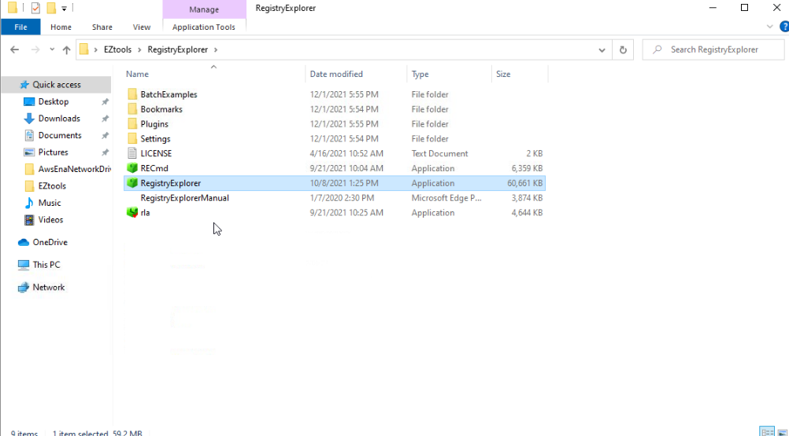

From **File > Load hive**, I selected all six hives out of `C:\Windows\System32\config` — `DEFAULT`, `DRIVERS`, `ELAM`, `SAM`, `SECURITY`, `SOFTWARE`, and `SYSTEM`.

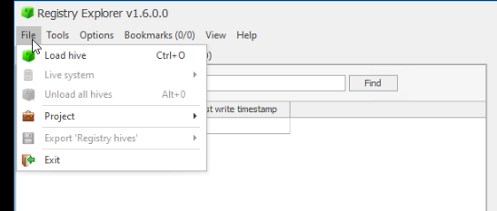
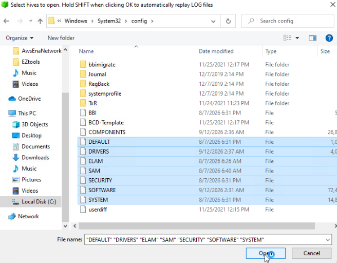

The first hurdle: Registry Explorer needs to be run **as Administrator** to load the live system hives, otherwise every hive fails to load with an "Administrator privileges not..." error.

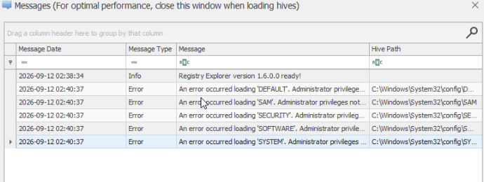

Relaunching via right-click > **Run as administrator** fixed it — all hives loaded cleanly with no dirty-hive or LSN-mismatch warnings.

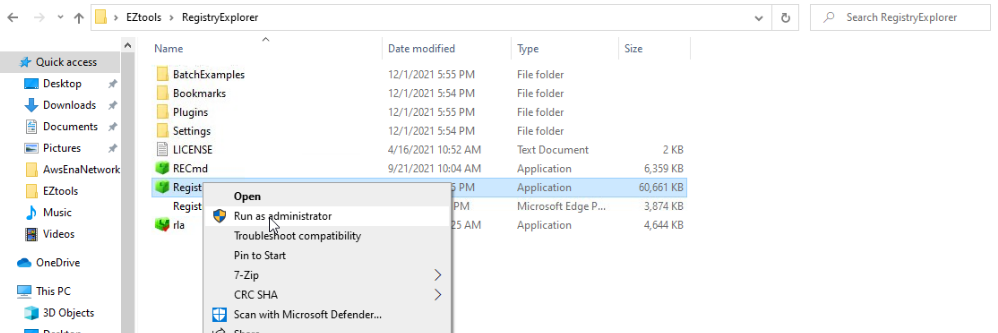

### Q1: How many user-created accounts are on the system?

Under the **Users** bookmark, the SAM hive showed six accounts total, but three of them (RIDs 500–504) are default/built-in Windows accounts, not user-created. The three accounts with RIDs in the `10xx` range are the actual user-created accounts:

- `THM-4n6`
- `thm-user`
- `thm-user2`

**Answer: 3**

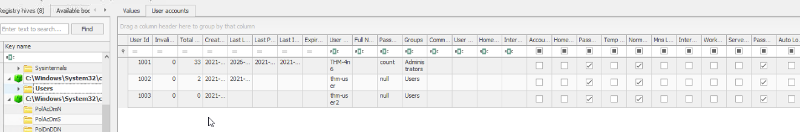

### Q2: Which account has never logged on?

Still in the same **User accounts** view, sorting by **Last Login Time** shows `THM-4n6` and `thm-user` both have login timestamps, but `thm-user2` has none.

**Answer: `thm-user2`**

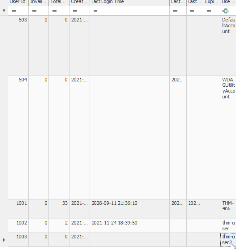

### Q3: What is the password hint for `THM-4n6`?

Same table — the password hint column shows the value **`count`** for `THM-4n6`.

**Answer: `count`**

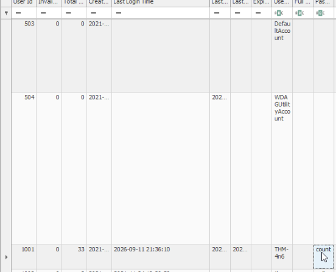

### Q4: When was `changelog.txt` last accessed?

I searched **RecentDocs** in the `NTUSER.DAT` hive for the `THM-4n6` user (loaded via **File > Live system > Users > THM-4n6 NTUSER.DAT**) and found `changelog.txt` in the recent documents list. Its last-opened timestamp is:

**Answer: 2021-11-24 18:18:48**

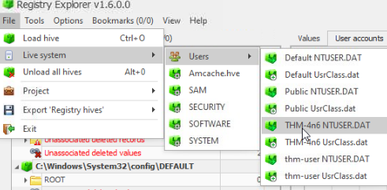

### Q5: Full path from which `python-3.8.2.exe` was run

My first pass through **RecentApps** in the SOFTWARE hive turned up a path for the Python installer, but that only reflects where the installer was launched from, not necessarily the correct artifact for "was run."

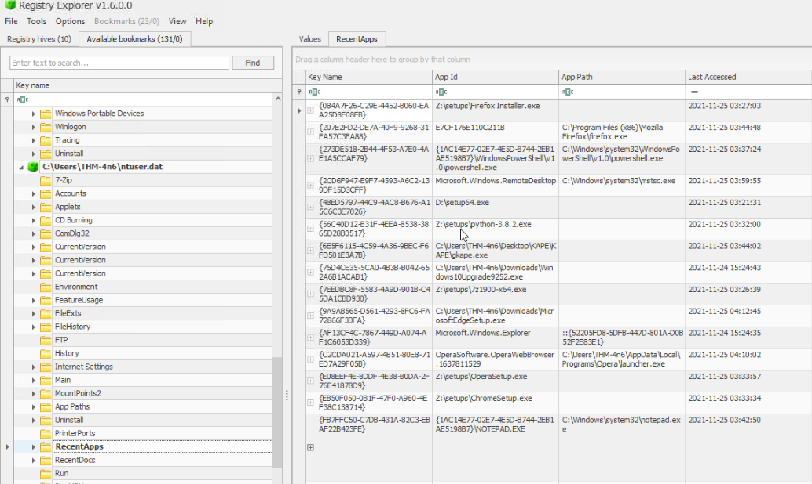

The correct artifact is **UserAssist** (`NTUSER.DAT > ... > UserAssist`), which tracks GUI program execution per user. Walking through each UserAssist GUID subkey's **Count** entries until I found the Python installer gave the full path:

**Answer: `Z:\setups\python-3.8.2.exe`**

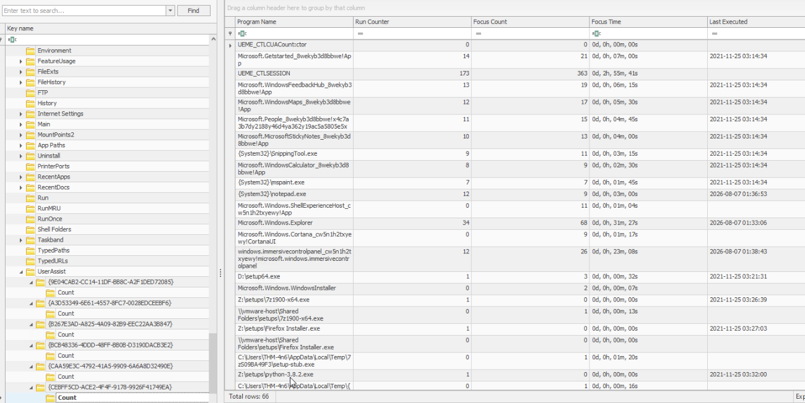

### Q6: Friendly name / connection time of the USB device

In the **SOFTWARE** hive under `Devices`, there were two `SWD#WPDBUSENUM#...` entries — I noted the serial number for each.

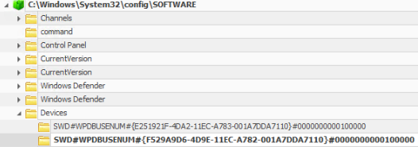

Cross-referencing those serial numbers against the **USBSTOR** key in the **SYSTEM** hive matched one of them to a Kingston DataTraveler 2.0 USB device, with a last-connected timestamp of:

**Answer: 2021-11-24 18:40:06**

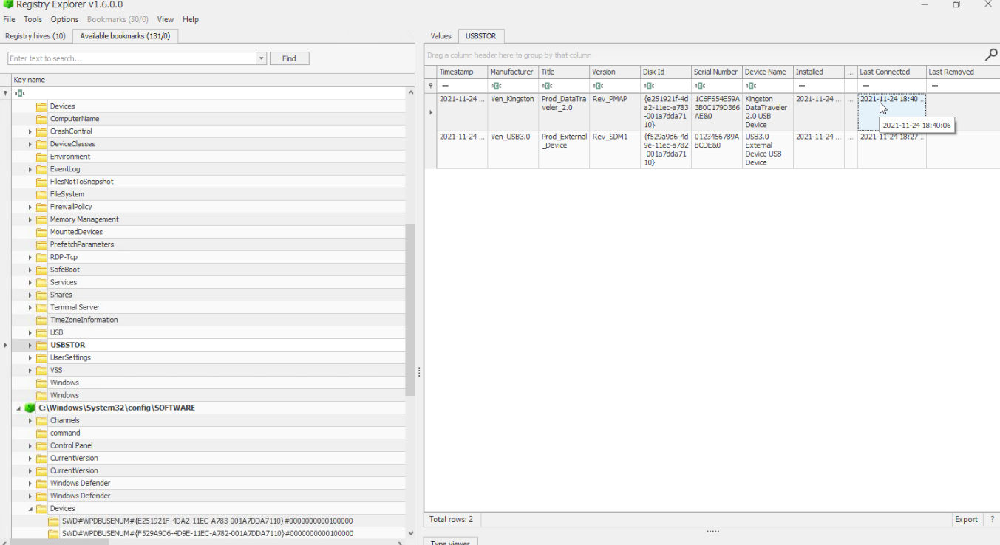

## Lessons Learned

- Registry Explorer must be run elevated to load live-system hives — an easy first-run gotcha.
- RID ranges matter when counting "user-created" accounts in SAM: 500–503/504 are Windows-provisioned defaults, `10xx`+ are actually created by a user/admin.
- RecentDocs/RecentApps show what a user *opened*, while UserAssist is the more reliable artifact for proving a program was actually *executed* — worth checking UserAssist first for "was this run" style questions instead of assuming RecentApps is authoritative.
- USB device identification requires correlating two hives: `SOFTWARE\...\Devices` gives you the device's serial number, and `SYSTEM\...\USBSTOR` gives you the friendly name and connection timestamps — neither hive has the full picture alone. (I actually keyed off the Disk ID rather than the serial number and it still lined up correctly, but serial number is the more precise field to match on.)
