# Windows Forensics 2

**Category:** TryHackMe
**Difficulty:** Medium
**Date:** 2026-09-29
**Tags:** windows-forensics, ntfs, mft, prefetch, jump-lists, windows-timeline, autopsy, eztools, dfir

Room: https://tryhackme.com/room/windowsforensics2

## Overview

The follow-up to [Windows Forensics 1](../windows-forensics-1/README.md). Where part 1 was all registry, this room moves to file system and execution artifacts: parsing the NTFS `$MFT` and `$Boot` files, recovering deleted files from a disk image with Autopsy, and proving program execution with Prefetch, the Windows 10 Timeline, and Jump Lists. Almost everything is done with Eric Zimmerman's command-line tools against a triage collection on the Desktop (`C:\Users\THM-4n6\Desktop\triage`), with the CSV output reviewed in EZViewer.

## Tools Used

| Tool | Artifact it parses | What I used it for |
|---|---|---|
| **MFTECmd** | NTFS metadata files (`$MFT`, `$Boot`, also `$J`, `$LogFile`, `$I30`) | File sizes from the `$MFT`, volume cluster size from `$Boot` |
| **PECmd** | Prefetch files (`C:\Windows\Prefetch\*.pf`) | Run count and last execution time of `gkape.exe` |
| **WxTCmd** | Windows 10 Timeline database (`ActivitiesCache.db`) | How long a program stayed in focus |
| **JLECmd** | Jump Lists (`AutomaticDestinations` / `CustomDestinations`) | Which program opened a file, and when a folder was first/last opened |
| **LECmd** | Shortcut (`.lnk`) files in `...\Windows\Recent` | File/folder open history (covered in the room alongside Jump Lists) |
| **EZViewer** | CSV / Excel files | Reviewing the output of all of the above |
| **Autopsy** (not an EZ tool) | Disk images | Browsing a USB image and recovering deleted files |

## Task 3: NTFS File System (MFTECmd)

The first step was parsing the `$MFT` from the triage folder with MFTECmd. It took a couple of tries to get the path right: the file lives at `triage\C\$MFT`, not `triage\$MFT`.

```
MFTECmd.exe -f "C:\Users\THM-4n6\Desktop\triage\C\$MFT" --csv "C:\Users\THM-4n6\Documents" --csvf myoutputfile.csv
```

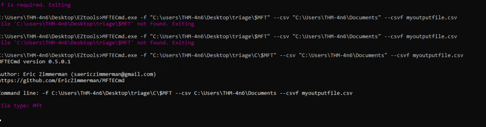

It processed about 196k FILE records in roughly a minute and wrote the CSV to Documents.

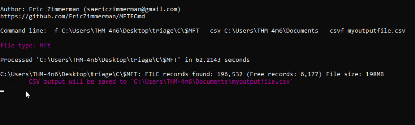

I opened the CSV in EZViewer (also under `EZtools`).

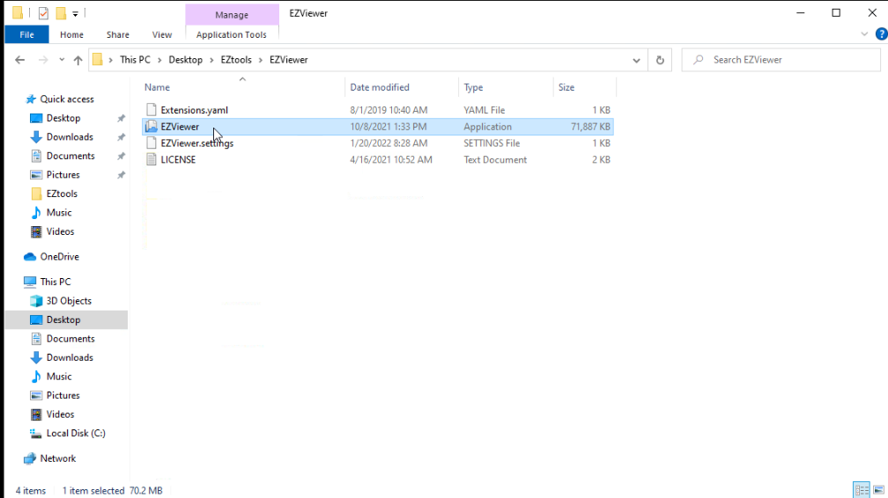
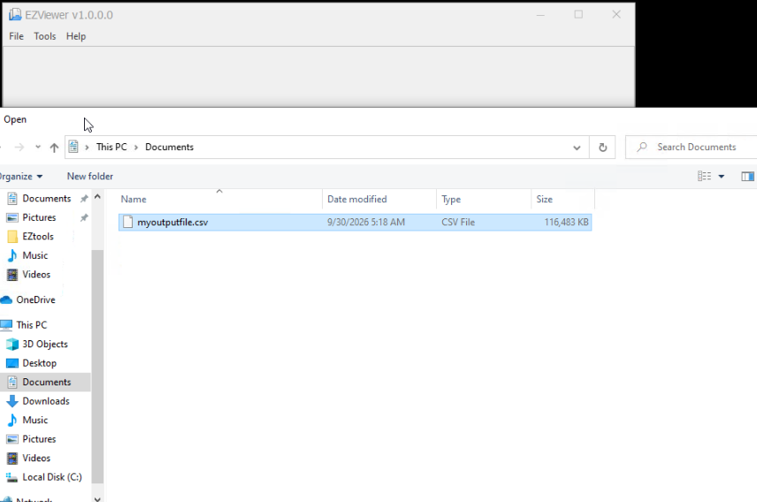

### Q: What is the size of the file located at `.\Windows\Security\logs\SceSetupLog.etl`?

The row with ParentPath `.\Windows\security\logs` and FileName `SceSetupLog.etl` has a FileSize of **49152**.

**Answer: `49152`**

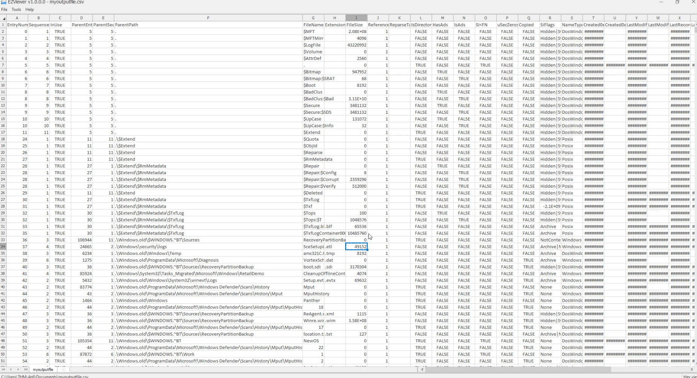

### Q: What is the cluster size of the volume the triage was taken from?

The `$MFT` doesn't hold this. After checking the hint, I found the cluster size comes from the **`$Boot`** file (the volume boot record). MFTECmd parses it the same way, and the cluster size is printed directly in the console output:

```
MFTECmd.exe -f "C:\Users\THM-4n6\Desktop\triage\C\$Boot" --csv "C:\Users\THM-4n6\Documents" --csvf bootoutputfile.csv
```

**Answer: `4096`**

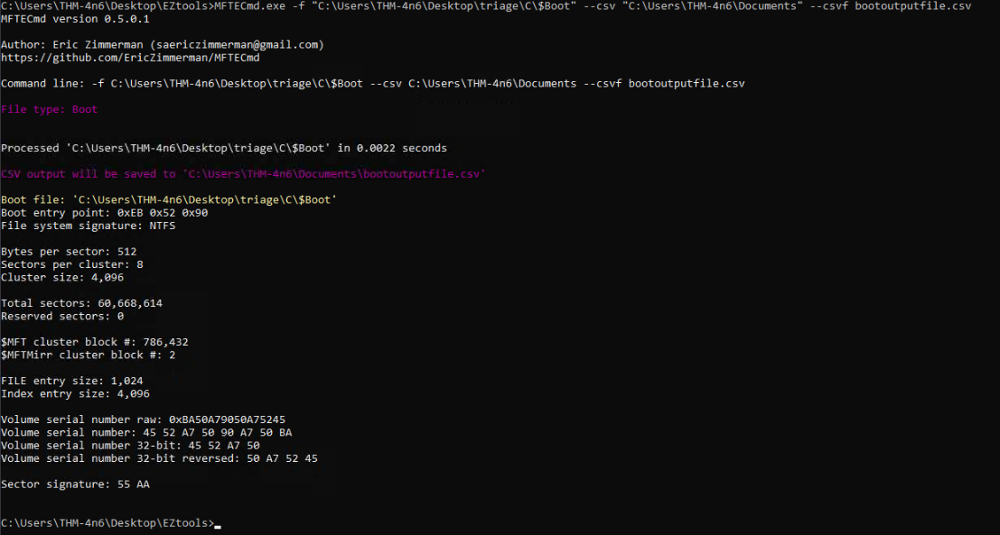

## Task 4: Recovering Deleted Files (Autopsy)

This task introduces disk images: a bit-by-bit copy of a drive, stored as a single file, that includes the file system metadata. You investigate a copy instead of the original evidence, so the original is never changed, and you can analyze the copy on any machine without special hardware.

Autopsy loads the image (`usb.001`) and lists everything on the volume, including files that were deleted but not yet overwritten. Those are marked with a red X and flagged as **Unallocated**.

### Q: There is another xlsx file that was deleted. What is its full name?

Two deleted Excel-related entries show up: a temporary `New Microsoft Excel Worksheet.xlsx~RFcd07702.TMP` file and the one we want.

**Answer: `TryHackme.xlsx`**

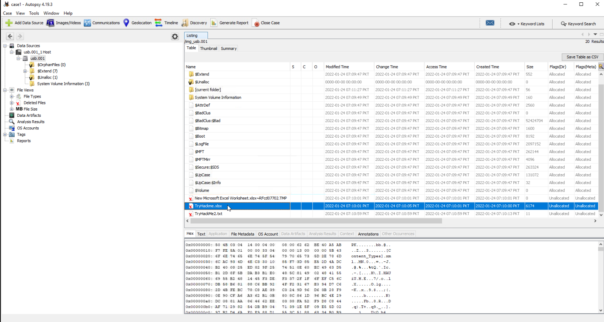

### Q: What is the name of the TXT file that was deleted from the disk?

**Answer: `TryHackMe2.txt`**

### Q: Recover the TXT file. What was written in it?

To recover it, right-click the file and choose **Extract File(s)**. The contents also show directly in the hex/text preview pane.

**Answer: `THM-4n6-2-4`**

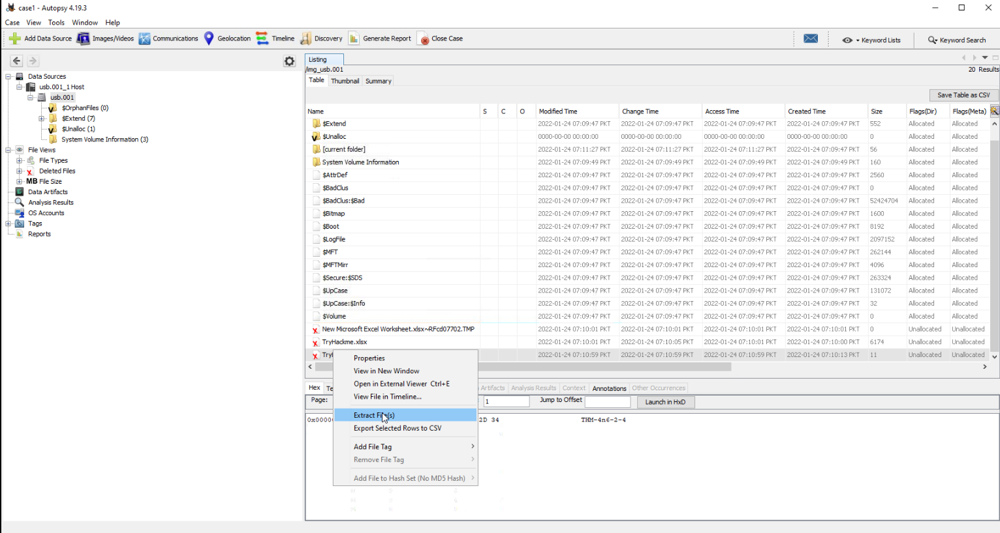

Recovering deleted files was my favorite part of the room.

## Task 5: Evidence of Execution

### Prefetch (PECmd)

A question about how many times something was executed points to **Prefetch**, which records a run count and the last several run times for each executable.

My first run was a mistake. I pointed PECmd at the live system's `C:\Windows\Prefetch` instead of the triage copy. It parsed all 244 prefetch files from the running VM, then failed to export because of a malformed output path. That turned out to be lucky, since those results would have been from the wrong evidence.

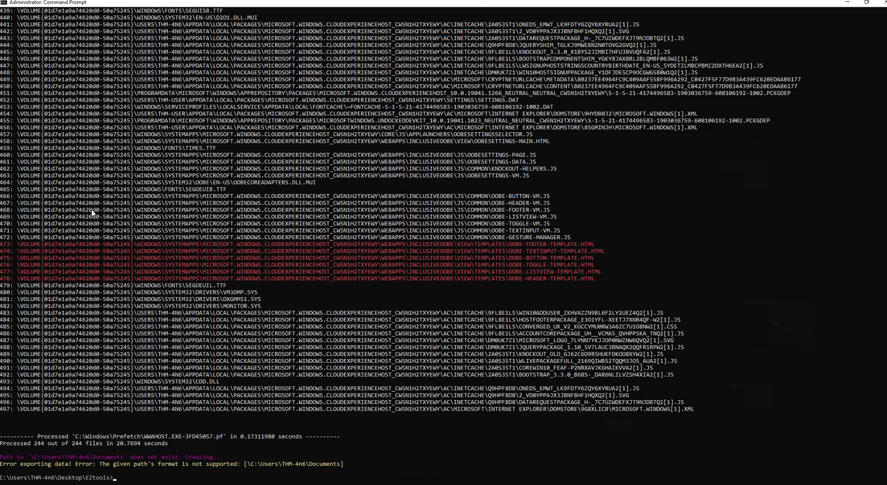

Pointing it at the triage collection worked:

```
PECmd.exe -d "C:\Users\THM-4n6\Desktop\triage\C" --csv "C:\Users\THM-4n6\Documents" --csvf prefetch.csv
```

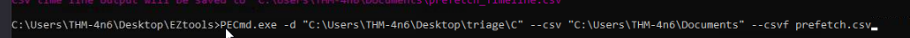

For each `.pf` file, PECmd prints the run count, last run times, and the directories and files the executable referenced. It writes two CSVs: `prefetch.csv` (one row per executable) and `prefetch_Timeline.csv` (one row per execution).

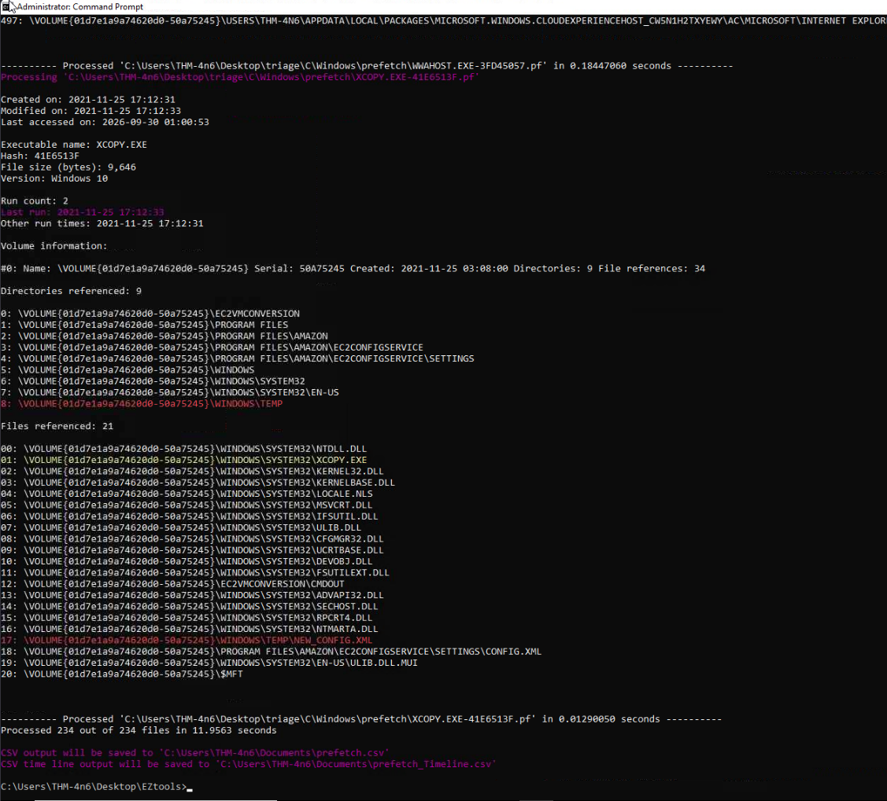

#### Q: How many times was `gkape.exe` executed?

In `prefetch.csv`, the `GKAPE.EXE` row has a run count of **2**.

**Answer: `2`**

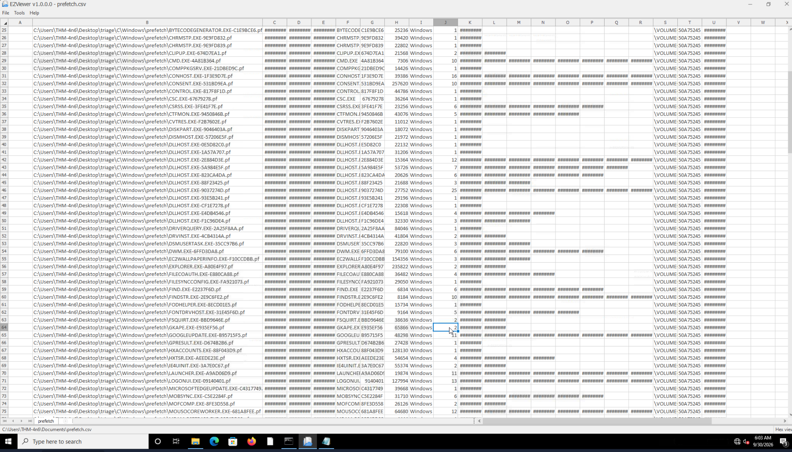

The timeline CSV has only two columns, `RunTime` and `ExecutableName`, so it gives a simple chronological list of every recorded execution.

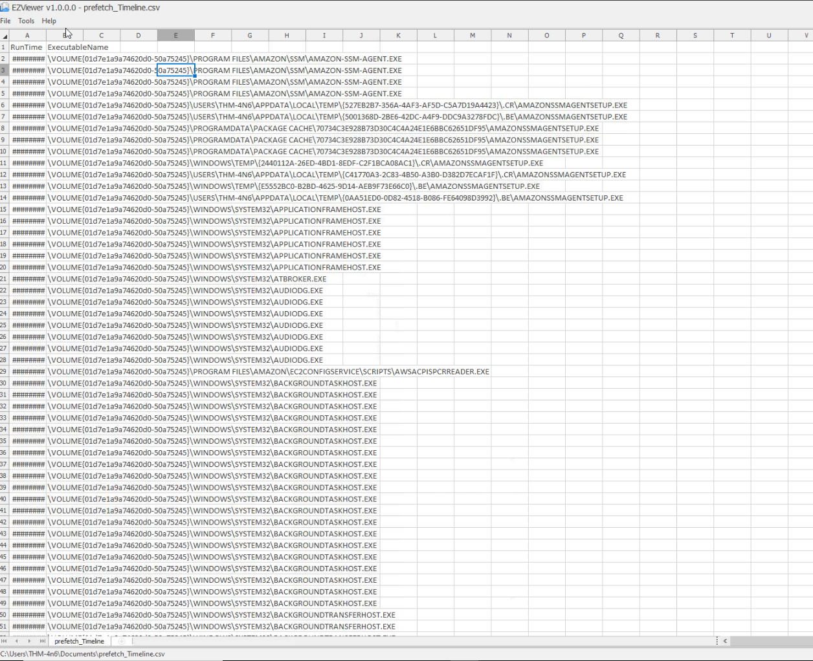

#### Q: What is the last execution time of `gkape.exe`?

This is in `prefetch.csv`. The LastRun column shows `########` until you widen it enough to display the timestamp. That had me confused for a minute.

**Answer: `12/01/2021 13:04`**

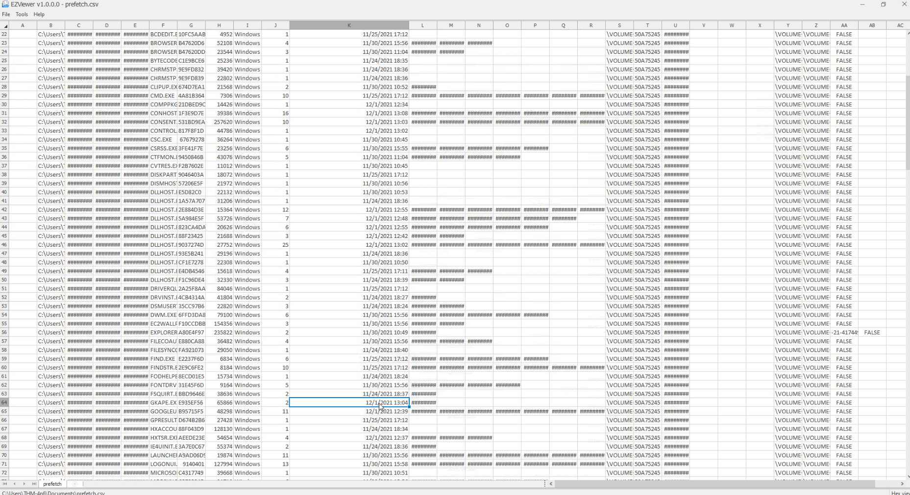

### Windows 10 Timeline (WxTCmd)

#### Q: When Notepad.exe was opened on 11/30/2021 at 10:56, how long did it stay in focus?

I first looked in the prefetch timeline. It shows a `NOTEPAD.EXE` execution at 11/30/2021 10:55, but Prefetch doesn't track focus time.

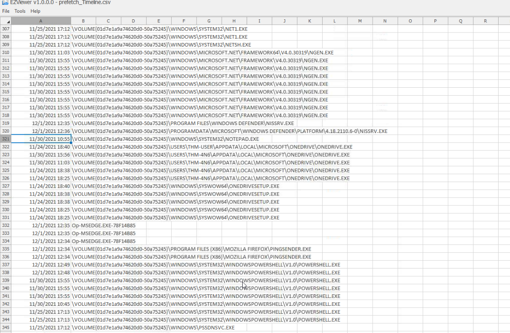

The hint pointed to the **Windows 10 Timeline** (`ActivitiesCache.db`), which records how long each app was in focus. I parsed it with WxTCmd:

```
WxTCmd.exe -f "C:\Users\THM-4n6\AppData\Local\ConnectedDevicesPlatform\L.THM-4n6\ActivitiesCache.db" --csv "C:\Users\THM-4n6\Documents" --csvf windows_timeline.csv
```

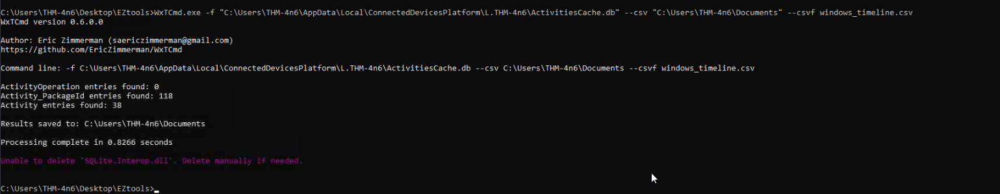

The output included a Notepad in-focus entry, but not on the date the question asked about, so I got stuck and looked up the answer.

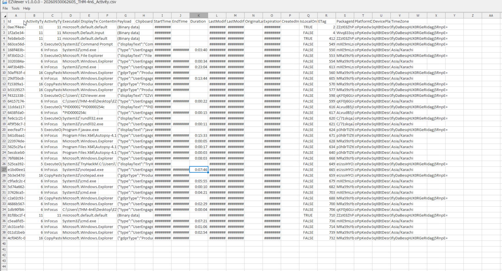

Looking at the screenshots later, I think I know what went wrong. The command points at the **live** user profile (`C:\Users\THM-4n6\AppData\...`), not the triage copy under `Desktop\triage\C\Users\THM-4n6\AppData\...`. With the StartTime column expanded, almost every entry is from **9/30/2026**, which is my own session on the VM: `cmd.exe`, EZViewer, Autopsy (`javaw.exe`), and the Notepad window I had just opened. It's the same mistake I made with PECmd, except this time the command succeeded and quietly parsed the wrong evidence.

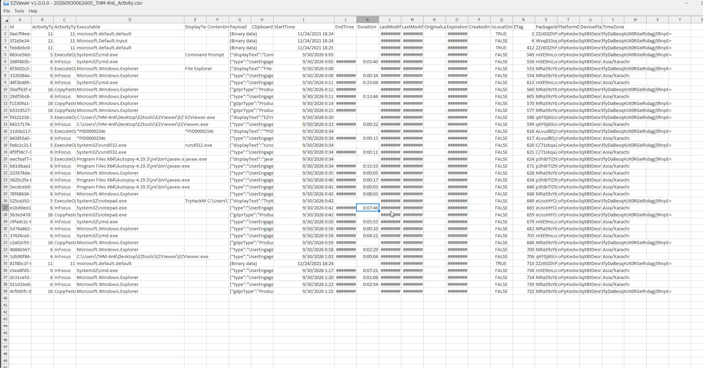

**Answer: `00:04:54`** (looked up, not found in my own output)

### Jump Lists (JLECmd)

#### Q: What program was used to open `C:\Users\THM-4n6\Desktop\KAPE\KAPE\ChangeLog.txt`?

Jump Lists record the files each application recently opened, keyed by AppId. I parsed the `AutomaticDestinations` folder from the triage collection:

```
JLECmd.exe -d C:\Users\THM-4n6\Desktop\triage\C\Users\THM-4n6\AppData\Roaming\Microsoft\Windows\Recent\AutomaticDestinations --csv C:\Users\THM-4n6\Desktop
```

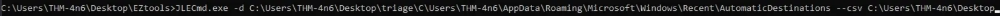

The `ChangeLog.txt` entry is under the AppId described as **Notepad 64-bit**.

**Answer: Notepad**

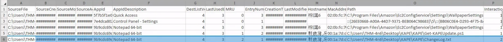

## Task 6: File/Folder Knowledge

This task covers the artifacts that show which files and folders a user opened: shortcut (`.lnk`) files, IE/Edge history, and Jump Lists. The workflow is the same as before: run the EZ tool against the triage copy, then filter the CSV in EZViewer. For shortcut files it's LECmd:

```
LECmd.exe -d C:\Users\THM-4n6\Desktop\triage\C\Users\THM-4n6\AppData\Roaming\Microsoft\Windows\Recent\ --csv C:\Users\THM-4n6\Desktop
```

### Q: When was the folder `C:\Users\THM-4n6\Desktop\regripper` last opened? When was it first opened?

In the output, the entry's creation time marks when the folder was first opened, and its last-modified time marks the most recent open.

**Answers:** last opened `12/1/2021 13:01`, first opened `12/1/2021 12:31`


It works, but it's tedious.

## Task 7: External Devices / USB Forensics

Part 1 identified USB devices through the registry. This task adds **`C:\Windows\inf\setupapi.dev.log`**, which gets an entry every time a new device is installed on the system. It's plain text, so Notepad is enough to read it.

### Q: Which artifact will tell us the first and last connection times of a removable drive?

**Answer: `setupapi.dev.log`**

## Lessons Learned

- **Check which copy of the evidence you're parsing.** I made this mistake twice. PECmd against the live `C:\Windows\Prefetch` failed, which was lucky. WxTCmd against the live `ActivitiesCache.db` succeeded and handed me my own activity from that session. When the timestamps in your output line up with when *you* were on the box, you're looking at the wrong data. Always point the tools at the triage collection.
- **Different questions need different NTFS files.** File-level details like size and path come from `$MFT`. Volume-level details like cluster size come from `$Boot`.
- **Each execution artifact answers a different question.** Prefetch gives run counts and last run times. The Windows 10 Timeline gives focus time. Jump Lists tell you which application opened a file.
- **`########` in EZViewer just means the column is too narrow.** Widen it before assuming the data is missing.
- **Deleted doesn't mean gone.** Until the space is overwritten, tools like Autopsy can recover the file from unallocated space, contents included.

  ## Sweeeeet
